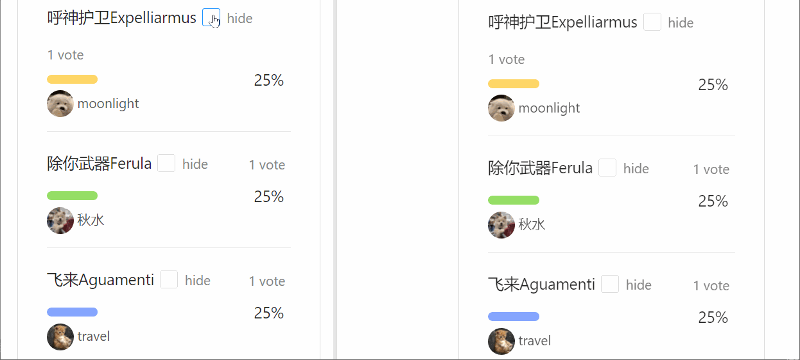

# [SimpleVote](https://starless.top) — A live-updating voting platform.

[SimpleVote](https://starless.top)是一个基于React + React Router + Ant Design + Express构建的实时更新的投票系统

项目展示地址 [https://starless.top](https://starless.top)

## Features
* **实时更新投票结果**  
websocket实现，对问题的投票，能够实时更新到每一个正在浏览该问题的用户页面上，而无需刷新

* **多种创建投票选项**  
包括是否多选，是否匿名发起，可选择截止时间等
* **切换投票展示页面**  
可展开或隐藏问题的详细信息，以及每一个选项的投票详情

* **验证功能**  
用户注册时需要输入验证码，找回密码时需要通过邮箱获取验证链接
* **流量控制**  
用户注册填写用户名时，实时检测是否重复，使用防抖函数控制检测次数；
实时更新投票结果时，使用节流函数，设定广播阈值为2秒

## Installation
SimpleVote 可通过如下命令实现自建
```sh
git clone -b self-host https://github.com/AStarlessNight/simple-vote.git

cd simple-vote

npm i 

node main.js
```
跳转[http://localhost:8081](http://localhost:8081)